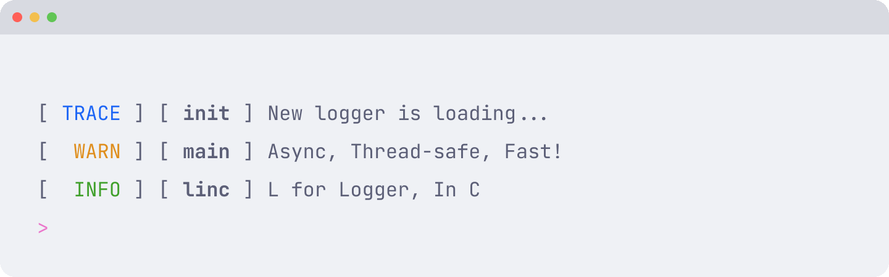
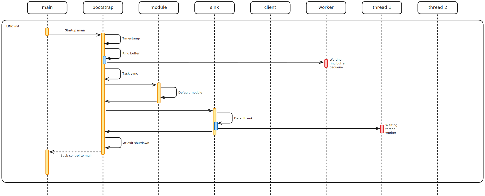
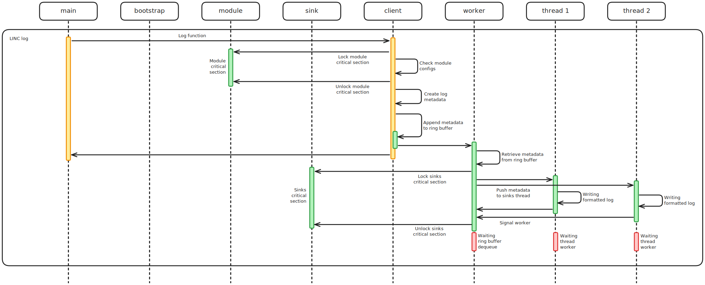

<picture>
    <source media="(prefers-color-scheme: dark)" srcset="assets/banner-dark.gif">
    <source media="(prefers-color-scheme: light)" srcset="assets/banner-light.gif">
    
</picture>

<br>
<br>

**A simple, asynchronous, and thread-safe logging library for C applications**

LINC is designed to solve the fundamental problem of debugging multi-threaded applications where shared I/O resources, like `stdout` or `stderr`, cause mixed and unreadable output from different threads. With LINC, developers can focus on their application logic without worrying about concurrent access to logging resources.

> [!NOTE]
>
> LINC is a university project developed for educational purposes. While functional, it may not have undergone extensive production-level testing. Consider established logging libraries for critical applications. The project welcomes contributions and feedback from the community.

## 🎯 Why LINC?

When developing multi-threaded applications, debugging becomes challenging due to:

- **Mixed output**: Multiple threads writing to the same I/O resource simultaneously
- **Race conditions**: Uncontrolled access to shared logging resources
- **Additional complexity**: Developers need extra synchronization code just for debugging

LINC eliminates these problems by providing controlled I/O operations without requiring additional synchronization work from developers.

## ✨ Key Features

- 🚀 **Zero Configuration**: Include the library and start logging immediately
- ⚡ **Asynchronous Design**: Minimal impact on client thread execution time
- 🧵 **Thread-Safe**: Built-in synchronization handles concurrent access
- 📦 **Modular System**: Organize logs by source with configurable levels
- 🔌 **Extensible Sinks**: Custom output destinations, like files, network, etc.
- 🎨 **Rich Formatting**: Timestamps, thread IDs, source location, etc.
- 💾 **Static Memory**: No dynamic allocations during runtime
- 🎛️ **Runtime Configuration**: Configure modules and sinks on-the-fly, like log levels and enabling or disabling

## 🎯 Target Applications

LINC is designed for a wide range of environments:

- Server applications
- Light real-time systems
- Embedded applications (non-hard real-time)
- Desktop applications
- Any multi-threaded C application requiring reliable logging

> [!NOTE]
>
> LINC is not currently suitable for hard real-time systems due to performance characteristics.

## 🚀 Quick Start

### Basic Usage

```c
#include "linc.h"

int main(void) {
    INFO("Application started");
    WARN("This is a warning message");
    ERROR("Something went wrong: %d", 42);

    return 0;
}
```

Output:

```
[ 2025-01-15 10:30:15.123 ] [ INFO  ] [ 00007f8b8c0a1740 ] [ main             ] main.c:4 main: Application started
[ 2025-01-15 10:30:15.124 ] [ WARN  ] [ 00007f8b8c0a1740 ] [ main             ] main.c:5 main: This is a warning message
[ 2025-01-15 10:30:15.125 ] [ ERROR ] [ 00007f8b8c0a1740 ] [ main             ] main.c:6 main: Something went wrong: 42
```

## 🏗️ Core Concepts

### Modules

Modules allow you to categorize and filter logs by source. Each module has its own configuration:

```c
// Create custom modules
linc_module db_module = linc_register_module("database", LINC_LEVEL_DEBUG, true);
linc_module net_module = linc_register_module("network", LINC_LEVEL_INFO, true);

// Use module-specific logging
DEBUG_M(db_module, "Database query executed");
INFO_M(net_module, "Connection established");

// Configure modules at runtime
linc_set_module_level(db_module, LINC_LEVEL_WARN);  // Change log level
linc_set_module_enabled(db_module, false);          // Disable module
```

### Sinks

Sinks define where and how logs are output. LINC includes a default stderr sink with customizable formatting:

```c
// Default sink with colors (if terminal supports it)
INFO("This log goes to stderr with colors");

// Configure default sink
linc_set_sink_level(linc_default_sink, LINC_LEVEL_ERROR);  // Only show errors
linc_set_sink_enabled(linc_default_sink, false);           // Disable default sink
```

### Filtering System

LINC uses a two-level filtering system:

1. **Module Filter** (Client-side): Filters logs before they enter the ring buffer
2. **Sink Filter** (Worker-side): Filters logs before output processing

```c
// Module level: LINC_LEVEL_INFO, Sink level: LINC_LEVEL_WARN
DEBUG_M(module, "Debug msg");   // ❌ Rejected by module (not created)
INFO_M(module, "Info msg");     // ⚠️ Created but rejected by sink
WARN_M(module, "Warning msg");  // ✅ Passes both filters
```

## 🏛️ Architecture

LINC's architecture is built around the principle of asynchronous, thread-safe logging with minimal impact on client threads. The system consists of several key components working together to provide reliable, high-performance logging in multi-threaded environments.

### System Initialization



LINC follows a "zero-configuration" philosophy, meaning the library initializes itself automatically without requiring explicit setup from the developer. This initialization happens in one of two ways, depending on the compiler being used:

**Automatic Initialization** (GCC/Clang)

When using GCC or Clang, LINC leverages the `__attribute__((constructor))` feature to automatically initialize the library before the `main()` function executes. This ensures that the logging system is ready for use as soon as the application starts, without any intervention from the developer.

**Lazy Initialization** (Other Compilers)

For compilers that don't support constructor attributes, LINC uses a lazy initialization approach with `pthread_once()`. The first call to any LINC function, whether logging or configuration, triggers the initialization process. This pattern ensures thread-safe initialization even in highly concurrent environments.

**Initialization Process**

The initialization sequence performs several critical setup operations:

1. **Timestamp Calibration**: LINC calculates an offset between monotonic and real-time clocks to provide accurate timestamps that remain consistent even if the system clock is adjusted during runtime.
2. **Ring Buffer Setup**: A bounded ring buffer is initialized with a configurable size, default 1024 entries. This buffer serves as the communication channel between client threads and the worker thread, using a classic producer-consumer pattern with mutex and condition variables for synchronization.
3. **Task Synchronization Framework**: A sophisticated synchronization system is established to coordinate between the worker thread and multiple sink threads. This system uses mutexes and condition variables to ensure proper ordering and completion of log processing tasks.
4. **Default Components**: LINC creates a default module named "main" and a default stderr sink, both configured with sensible defaults that work out-of-the-box for most applications.
5. **Worker Thread Creation**: A dedicated worker thread is spawned to handle all log processing asynchronously. This thread runs continuously, processing log entries from the ring buffer and distributing them to appropriate sinks.
6. **Shutdown Registration**: The system registers a cleanup function with `atexit()` to ensure proper shutdown when the application terminates. This includes signaling the worker thread to stop, waiting for pending logs to be processed, and closing all sink resources.

### Logging Flow and Internal Processing



The logging process in LINC is carefully designed to minimize the time spent by client threads while ensuring thread safety and reliable delivery. Here's how a typical log entry flows through the system:

**Phase 1: Client-Side Processing**

When a client thread calls a logging function, e.g., `INFO("message")`, the following steps occur:

1. **Module Validation**: The system first acquires a read lock on the specified module's configuration. This implements a reader-writer pattern where multiple threads can simultaneously read module settings, but configuration changes, which acquire write locks, are mutually exclusive with logging operations.
2. **Level Filtering**: Once the module lock is acquired, LINC checks if the log should proceed based on two criteria:
   - Is the module enabled?
   - Is the log level equal to or higher than the module's configured minimum level?
   - If either check fails, the function returns immediately without creating any log entry, minimizing overhead for filtered-out logs.
3. **Metadata Creation**: For logs that pass the module filter, LINC creates a comprehensive metadata structure containing:
   - High-precision timestamp with nanosecond resolution
   - Log level
   - Thread ID of the calling thread
   - Module name
   - Source file name and line number, provided by `__FILE__` and `__LINE__` macros
   - Function name, provided by `__func__`
   - Formatted message string, processed using `vsnprintf` with the provided format and arguments
4. **Ring Buffer Enqueue**: The metadata is then enqueued into the ring buffer using a producer-consumer synchronization pattern. The client thread:
   - Acquires the ring buffer mutex
   - Checks if there's space available, if the buffer is full, the thread waits on a condition variable
   - Places the metadata at the head position and advances the head pointer
   - Signals the consumer condition variable to wake up the worker thread if it's waiting
   - Releases the ring buffer mutex

At this point, the client thread's work is complete, and it can continue with its application logic. The total time spent in the logging function is typically just a few microseconds, even under high concurrency.

**Phase 2: Asynchronous Processing**

The worker thread operates in a continuous loop, processing log entries asynchronously:

1. **Ring Buffer Dequeue**: The worker thread waits on the consumer condition variable until log entries are available. When awakened, it:
   - Acquires the ring buffer mutex
   - Retrieves the metadata from the tail position and advances the tail pointer
   - Signals the producer condition variable to wake up any client threads waiting for space
   - Releases the ring buffer mutex
2. **Sink Distribution**: For each dequeued log entry, the worker thread coordinates with all registered sink threads:
   - Acquires a read lock on the sink list configuration
   - Sets up shared metadata for all sink threads to process
   - Uses a sophisticated task synchronization system to wake up all sink threads simultaneously
   - Waits for all sink threads to complete their processing before moving to the next log entry

**Phase 3: Sink Processing**

Each registered sink runs in its own dedicated thread, allowing for parallel I/O operations:

1. **Sink Validation**: Each sink thread checks if it should process the current log entry:
   - Is the sink enabled?
   - Is the log level equal to or higher than the sink's configured minimum level?
2. **Output Processing**: For sinks that should process the log, the sink's custom `write` function is called. This function can:
   - Format the log according to the sink's requirements, plain text, JSON, XML, etc.
   - Write to various destinations, files, network sockets, databases, etc.
   - Apply sink-specific filtering or transformations
3. **Synchronization**: Once processing is complete, each sink thread signals back to the worker thread that it has finished processing the current log entry.

### Memory Management and Performance Characteristics

LINC's memory management strategy is designed for predictability and performance:

**Static Allocation**

All memory is allocated statically at initialization time, including:

- Ring buffer entries, fixed array of metadata structures
- Module list, fixed array with configurable maximum
- Sink list, fixed array with configurable maximum
- Thread stacks, managed by the pthread library

This approach eliminates the unpredictable latencies associated with dynamic memory allocation and makes the system suitable for soft real-time applications.

**Current Bottlenecks**

While LINC provides excellent performance for most use cases, there are known bottlenecks:

- The ring buffer mutex serializes all client threads, which can become contention point under very high load
- The worker thread waits for the slowest sink to complete before processing the next log entry
- Bounded buffer policy can cause client threads to block if the buffer becomes full

### Thread Safety and Synchronization

LINC employs multiple synchronization mechanisms to ensure thread safety:

**Reader-Writer Locks** for configuration changes, allowing multiple concurrent readers, logging operations, while ensuring exclusive access for writers, configuration changes.

**Producer-Consumer Pattern** with mutex and condition variables for ring buffer access, providing efficient blocking and wakeup semantics.

**Task Synchronization Framework** using mutexes and condition variables to coordinate between worker and sink threads, ensuring proper ordering and completion signaling.

This multi-layered approach to synchronization ensures that LINC remains thread-safe even under high concurrency while minimizing lock contention where possible.

## 🔧 Advanced Usage

### Creating Custom Modules

```c
// Create modules for different application components
linc_module auth_module = linc_register_module("auth", LINC_LEVEL_INFO, true);
linc_module db_module = linc_register_module("database", LINC_LEVEL_DEBUG, true);
linc_module api_module = linc_register_module("api", LINC_LEVEL_TRACE, true);

void authenticate_user(const char* username) {
    INFO_M(auth_module, "Authentication attempt for user: %s", username);
    // ... authentication logic
    WARN_M(auth_module, "Invalid credentials for user: %s", username);
}
```

### Creating Custom Sinks

To create a custom sink, implement four functions:

```c
struct my_sink_data {
    FILE *file;
    const char *filename;
};

int my_sink_open(void* data) {
    struct my_sink_data *sink_data = (struct my_sink_data *)data;
    sink_data->file = fopen(sink_data->filename, "w");
    return (sink_data->file != NULL) ? 0 : -1;
}

int my_sink_close(void* data) {
    struct my_sink_data *sink_data = (struct my_sink_data *)data;
    if (sink_data->file) {
        fclose(sink_data->file);
        sink_data->file = NULL;
    }
    return 0;
}

int my_sink_write(void* data, struct linc_metadata* metadata) {
    struct my_sink_data *sink_data = (struct my_sink_data *)data;

    // Custom formatting
    char log_buffer[1024];
    int written = linc_stringify_metadata(metadata, log_buffer, sizeof(log_buffer), false);

    if (written > 0) {
        fwrite(log_buffer, sizeof(char), written, sink_data->file);
    }
    return 0;
}

int my_sink_flush(void* data) {
    struct my_sink_data *sink_data = (struct my_sink_data *)data;
    return fflush(sink_data->file);
}

// Register the custom sink
struct my_sink_data file_data = {
    .filename = "app.log",
    .file = NULL,
};
struct linc_sink_funcs file_funcs = {
    .data = &file_data,
    .open = my_sink_open,
    .close = my_sink_close,
    .write = my_sink_write,
    .flush = my_sink_flush,
};

linc_sink file_sink = linc_register_sink("file", LINC_LEVEL_TRACE, true, file_funcs);
```

## 📚 Examples

The repository includes practical examples:

- **[File Sink](examples/file_sink/)**: HTTP server that logs to a file
- **[Network Sink](examples/network_sink/)**: Multi-threaded application that sends logs to an HTTP backend

## 📖 API Reference

### Logging Macros

```c
// Default module logging
TRACE(format, ...);
DEBUG(format, ...);
INFO(format, ...);
WARN(format, ...);
ERROR(format, ...);
FATAL(format, ...);

// Module-specific logging
TRACE_M(module, format, ...);
DEBUG_M(module, format, ...);
INFO_M(module, format, ...);
WARN_M(module, format, ...);
ERROR_M(module, format, ...);
FATAL_M(module, format, ...);
```

### Module Management

```c
linc_module linc_register_module(const char* name, enum linc_level level, bool enabled);
int linc_set_module_level(linc_module module, enum linc_level level);
int linc_set_module_enabled(linc_module module, bool enabled);
```

### Sink Management

```c
linc_sink linc_register_sink(const char* name, enum linc_level level, bool enabled, struct linc_sink_funcs funcs);
int linc_set_sink_level(linc_sink sink, enum linc_level level);
int linc_set_sink_enabled(linc_sink sink, bool enabled);
```

### Utility Functions

```c
int64_t linc_timestamp(void);
int linc_timestamp_string(int64_t timestamp, char* buffer, size_t size);
const char* linc_level_string(enum linc_level level);
int linc_stringify_metadata(struct linc_metadata* metadata, char* buffer, size_t length, bool use_colors);
```

### Log Levels

```c
enum linc_level {
    LINC_LEVEL_TRACE = 0,  // Detailed debugging information
    LINC_LEVEL_DEBUG = 1,  // Development debugging info
    LINC_LEVEL_INFO = 2,   // General application state
    LINC_LEVEL_WARN = 3,   // Potential issues
    LINC_LEVEL_ERROR = 4,  // Something went wrong
    LINC_LEVEL_FATAL = 5,  // Critical errors
};
```

## ⚠️ Known Limitations

### Current Limitations

1. **Ring Buffer Bottleneck**: The mutex protecting the ring buffer serializes all producer threads, which can become a bottleneck under heavy concurrent logging.
2. **Bounded Buffer Blocking**: When the ring buffer is full, producer threads must wait for the worker to consume entries, potentially causing delays.
3. **Sink Synchronization**: The worker thread waits for all sinks to complete processing before handling the next log entry. Slow sinks (e.g., network sinks) can impact overall logging performance.
4. **Error Handling**: Error handling throughout the system is not yet complete and will be improved in future versions.
5. **Hard Real-time Unsuitable**: Current performance characteristics make LINC unsuitable for hard real-time systems.

### Important Notes

- **Sink Data Lifetime**: When using custom sinks, ensure that data passed to sink functions remains valid throughout the application lifetime. Avoid defining sink data structures within `main()` as they may become invalid during shutdown.
- **Reader-Writer Consistency**: Configuration changes (module/sink settings) use reader-writer locks. Some logs may be processed with the old configuration if they're generated during a configuration change.

## 🛣️ Future Improvements

### Performance Enhancements

- **Lock-free Ring Buffer**: Replace mutex-based ring buffer with lock-free implementation to eliminate serialization bottleneck
- **Multiple Ring Buffers**: Consider per-thread or partitioned ring buffers to reduce contention
- **Sink Decoupling**: Remove or redesign worker-sink synchronization to prevent slow sinks from affecting overall performance

### Feature Enhancements

- **Comprehensive Error Handling**: Implement robust error handling throughout the system
- **Retry Mechanisms**: Add configurable retry logic for failing sinks
- **Log Rotation**: Built-in log rotation support for file sinks
- **Configuration Files**: Support for configuration files and runtime reconfiguration
- **Additional Sink Types**: More built-in sink implementations (syslog, database, etc.)

### Quality Improvements

- **Extended Testing**: Comprehensive test suite including stress testing and edge cases
- **Documentation**: Detailed API documentation and more usage examples
- **Portability**: Improved support for different platforms and compilers

## 🤝 Contributing

Contributions are welcome! Whether it's bug fixes, feature improvements, documentation, or examples, your help is appreciated.

## 📄 License

This project is open source. Please refer to the license file for specific terms and conditions.
